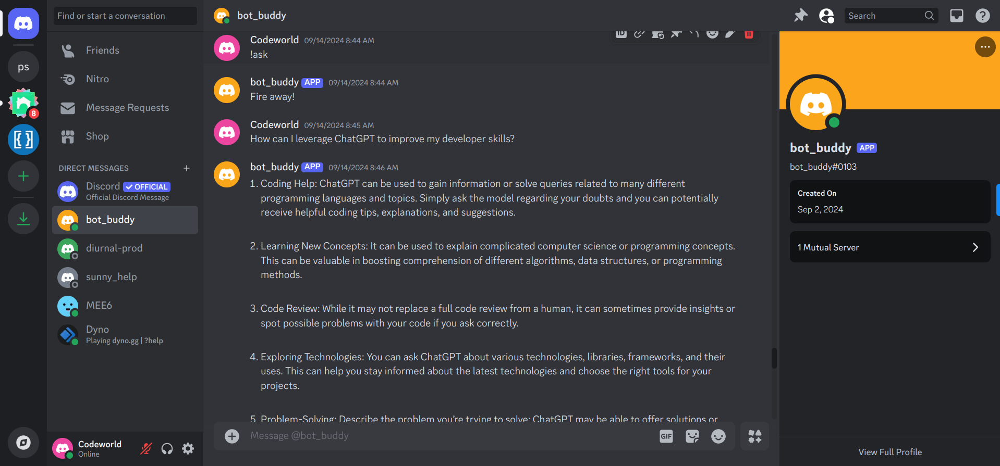

# BotBuddy Discord Bot

A versatile Discord bot designed to enhance server experiences with a variety of interactive features, built using Python and `discord.py`.



[Add BotBuddy on Discord](https://discord.com/oauth2/authorize?client_id=1296658070159753377)

## Features

1. **Bot Setup**

   - Automate tasks within your environment with easy setup.

2. **Command Integration**

   - Process specific commands for efficient interaction.

3. **Environment Configuration**

   - Load environment variables for necessary settings.

4. **ChatGPT Integration**

   - Get intelligent responses to queries through ChatGPT.

5. **Conversation History**

   - Maintain context with stored conversation history.

6. **Database Storage**

   - Ensure persistent and easily retrievable data with database storage.

7. **Welcome Message**

   - Greet new members to make them feel welcomed.

8. **Inspirational Quotes**

   - Receive random quotes to boost motivation.

9. **Support the Creator**

   - Use the "Buy Me a Coffee" feature to support development.

10. **New Year Celebration**

    - Celebrate with a special message on New Year's Day.

11. **Birthday Celebration**

    - Receive a celebratory message on your birthday.

12. **Task Reminders**

    - Set reminders to manage tasks effectively.

13. **Recurring Reminders**

    - Set recurring reminders for consistent task management.

14. **Command Usage**
    - Use simple commands like `/ping` for straightforward communication.

## Getting Started

### Prerequisites

- Python 3.8+
- `discord.py` library
- Discord account

### Installation

1. Clone the repository:

   ```bash
   git clone https://github.com/Bluette1/bot_buddy.git
   cd bot_buddy
   ```

2. Install dependencies:

   ```bash
   pip install -r requirements.txt
   ```

3. Set up your `.env` file with your Discord bot token:

   ```env
   DISCORD_BOT_TOKEN=
   OPENAI_API_KEY=
   MONGODB_URI=
   ```

4. Run the bot:
   ```bash
   python bot.py
   ```

5. Run tests:
   ```bash
   pytest tests/
   ```

## Usage

Add BotBuddy to your Discord server using the invite link. Use commands to interact with the bot, such as:

- `/ping`: Responds with "pong".
- `/quote`: Receive an inspirational quote.
- `!remind [task] at [24_hr_format_time]`: Set a reminder for a task.
- `!birthday [Month] [Day]`: Get a birthday message.

## Contributing

Contributions are welcome! Please fork the repository and submit a pull request.
[User Stories](https://www.notion.so/BotBuddy-118e6a4d98f280f0ba0ec086577831b4?pvs=4)

## License

This project is licensed under the MIT License.

## Contact

For any questions or feedback, please contact [marylene.sawyer@gmail.com](mailto:marylene.sawyer@gmail.com).

```

Feel free to modify as needed!
```
